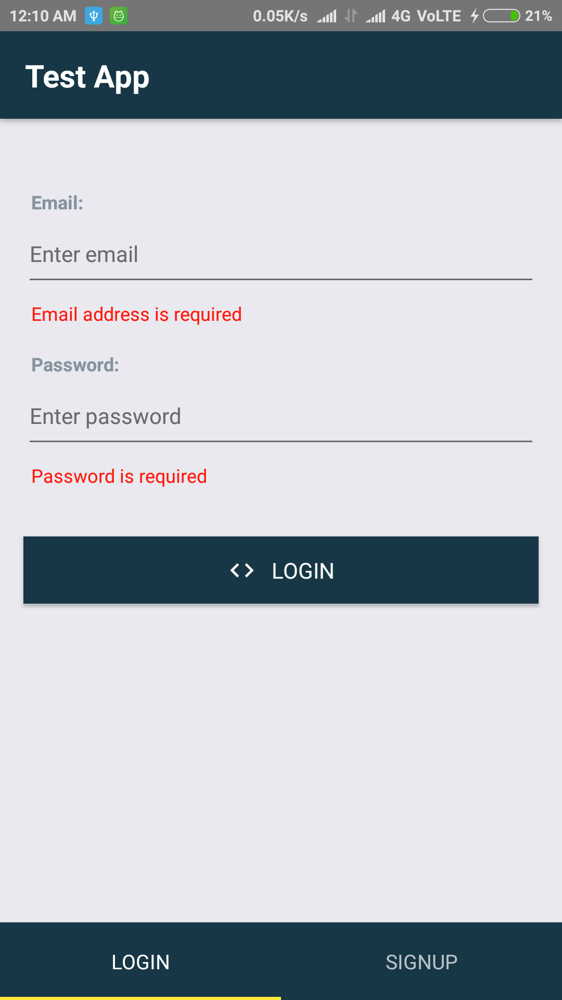
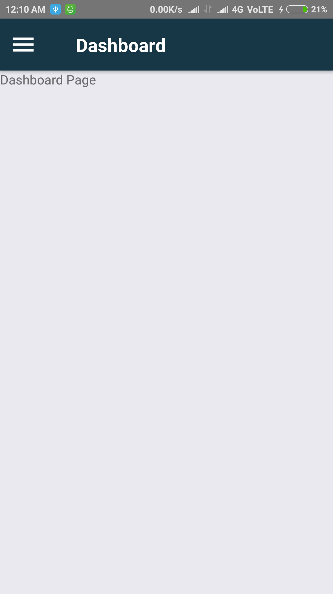
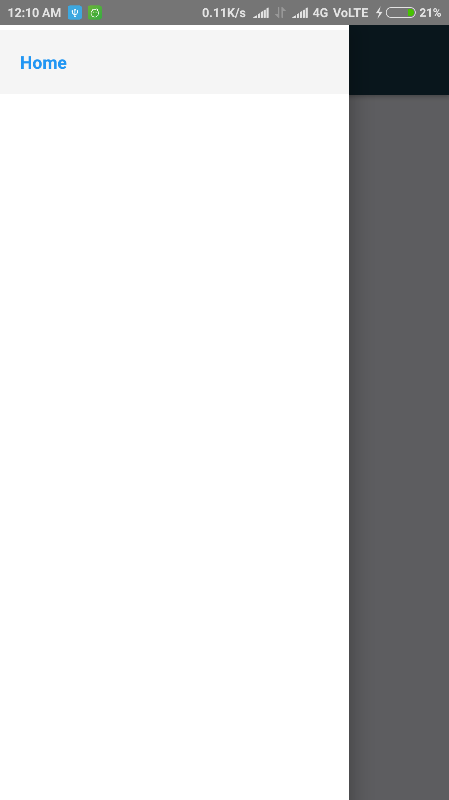

# Using React-Navigation (Version 5)

Implemented all three modes of navigation for react-native.
To know more about this library refer:

https://reactnavigation.org/docs/getting-started/

## Packages Used

* @react-navigation/native
* @react-navigation/stack
* react-native-gesture-handler 
* react-native-reanimated 
* react-native-screens 
* react-native-safe-area-context 
* @react-native-community/masked-view

## Screen 1

## Screen 2

## Screen 3

